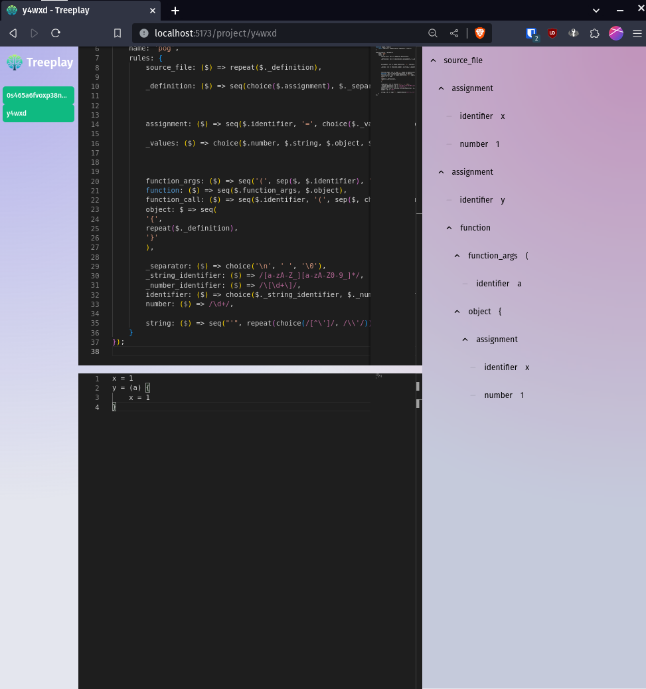

# Treeplay

A simple UI front end and parse-tree explorer for Tree-sitter.



## Usage

Make sure to read the install instructions of tree-sitter [here](<[https://](https://tree-sitter.github.io/tree-sitter/creating-parsers)>)

You will need to have it installed locally for it to work.

Then simply run:

```bash
bun i
bun dev
```

And create a new project!

## Security

Keep in mind that the `grammar.js` is ran as it, and is not sanitized and does not provide any sandboxing. It is recommended to only use this tool only locally.
